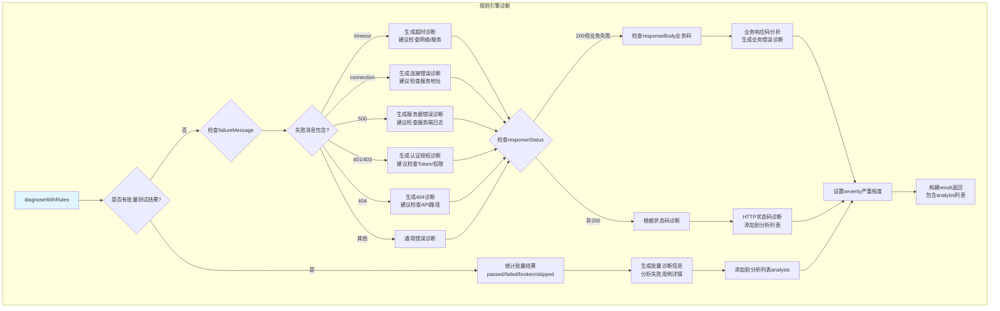
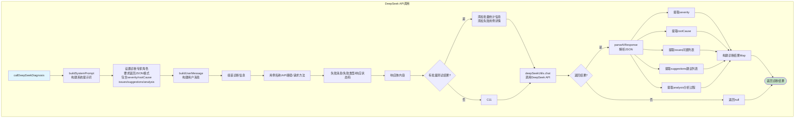
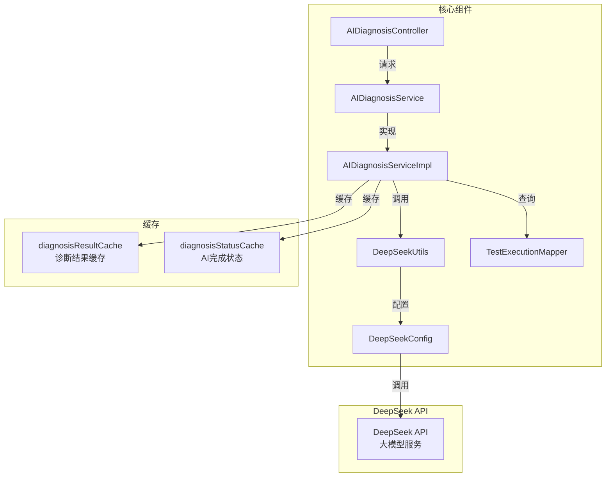
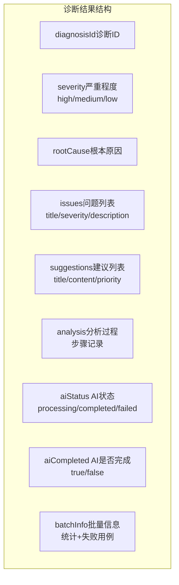

# AI诊断流程图

## 1. AI诊断整体流程

```mermaid
flowchart TD
    subgraph AI诊断流程
        A1(["开始"]) --> A2[Controller接收请求<br/>/api/ai-diagnosis/execute]
        A2 --> A3[解析请求参数<br/>failureMessage/failureType<br/>responseStatus/responseBody<br/>apiPath/apiMethod/caseName]
        
        A3 --> A4{是否有executionId?}
        A4 -->|是| A5[查询测试结果<br/>testExecutionMapper<br/>.findTestCaseResultsByExecutionId]
        A4 -->|否| A6{是否有caseResults?}
        A6 -->|是| A7[convertToTestCaseResults<br/>转换前端传递的用例结果]
        A6 -->|否| A8[无测试结果数据]
        
        A5 --> A9[diagnoseWithRules<br/>规则引擎诊断]
        A7 --> A9
        A8 --> A9
        
        A9 --> A10[生成diagnosisId<br/>UUID]
        A10 --> A11[设置aiStatus=processing<br/>缓存诊断结果]
        A11 --> A12[callDeepSeekDiagnosisAsync<br/>异步调用DeepSeek]
        A12 --> A13[返回初步诊断结果<br/>包含diagnosisId]
        A13 --> A14([结束])
        
        A12 -.-> A15[异步执行DeepSeek API]
        A15 --> A16[构建系统提示词<br/>buildSystemPrompt]
        A16 --> A17[构建用户消息<br/>buildUserMessage]
        A17 --> A18[deepSeekUtils.chat<br/>调用DeepSeek API]
        A18 --> A19[parseAIResponse<br/>解析AI返回JSON]
        A19 --> A20[更新缓存<br/>aiStatus=completed]
    end

    style A1 fill:#e1f5fe
    style A14 fill:#c8e6c9
```



## 2. 规则引擎诊断流程



## 3. DeepSeek API调用流程



## 4. 诊断结果查询流程

```mermaid
flowchart TD
    subgraph 诊断结果查询
        D1(["开始"]) --> D2[Controller接收请求<br/>/api/ai-diagnosis/result/{diagnosisId}]
        D2 --> D3[aiDiagnosisService<br/>.getDiagnosisResult]
        D3 --> D4{缓存中是否存在?}
        
        D4 -->|是| D5[获取缓存结果]
        D5 --> D6[判断AI是否完成<br/>diagnosisStatusCache]
        D6 --> D7[设置aiCompleted标志]
        D7 --> D8[返回诊断结果]
        D8 --> D9([结束])
        
        D4 -->|否| D10[返回null]
        D10 --> D9
    end

    style D1 fill:#e1f5fe
    style D9 fill:#c8e6c9
```

## 5. 核心组件关系



## 6. 诊断数据结构



## 流程说明

### 1. AI诊断整体流程
1. Controller接收诊断请求，解析参数（失败消息、响应状态码、响应体等）
2. 根据executionId查询测试结果，或使用前端传递的caseResults
3. 先执行规则引擎诊断 `diagnoseWithRules()`，生成初步诊断结果
4. 生成diagnosisId，返回初步结果（aiStatus=processing）
5. 异步调用DeepSeek API进行深度诊断
6. AI诊断完成后更新缓存状态

### 2. 规则引擎诊断
- **批量测试**：统计通过/失败/异常/跳过数量，分析失败用例详情
- **失败消息分析**：根据错误消息关键词（timeout/connection/500/401/403/404）生成诊断
- **HTTP状态码**：根据响应状态码生成对应诊断
- **业务响应码**：解析响应体中的业务码，生成业务错误诊断

### 3. DeepSeek API调用
- **系统提示词**：设置诊断专家角色，要求返回JSON格式（severity/rootCause/issues/suggestions/analysis）
- **用户消息**：组装诊断信息，包括用例信息、API信息、失败信息、批量统计等
- **调用API**：通过DeepSeekUtils调用DeepSeek大模型
- **解析结果**：解析AI返回的JSON，提取各项诊断内容

### 4. 诊断结果查询
- 通过diagnosisId查询诊断结果
- 从缓存中获取结果
- 判断AI是否已完成（aiCompleted标志）
- 返回完整诊断结果

### 5. 返回数据结构
- `diagnosisId`: 诊断ID
- `severity`: 严重程度（high/medium/low）
- `rootCause`: 根本原因
- `issues`: 问题列表
- `suggestions`: 修复建议
- `analysis`: 分析过程记录
- `aiStatus`: AI处理状态（processing/completed/failed）
- `aiCompleted`: AI是否完成标志