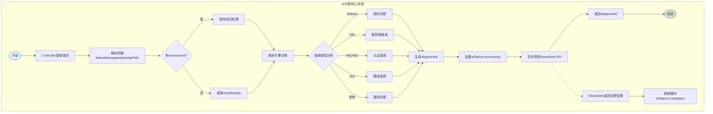
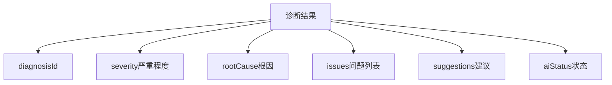

# AI诊断简洁流程图

## 核心流程



## 查询诊断结果

```mermaid
flowchart TD
    A([开始]) --> B[查询请求<br/>/result/{diagnosisId}]
    B --> C{缓存存在?}
    C -->|是| D[获取诊断结果]
    C -->|否| E[返回null]
    D --> F{AI完成?}
    F -->|是| G[aiCompleted=true]
    F -->|否| H[aiCompleted=false]
    G --> I[返回结果]
    H --> I
    I --> J([结束])
    
    style A fill:#e1f5fe
    style J fill:#c8e6c9
```

## 关键数据结构



## 流程要点

1. **双层诊断**: 规则引擎 → DeepSeek AI
2. **异步处理**: 立即返回diagnosisId，AI后台处理
3. **缓存机制**: 诊断结果和状态分开缓存
4. **错误分类**: timeout/500/401/403/404 等
