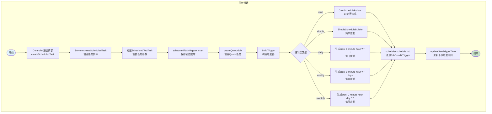
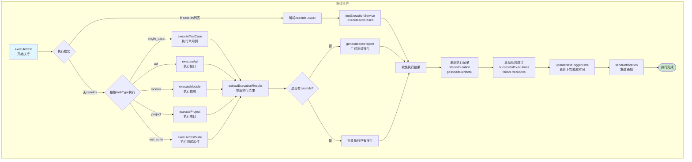
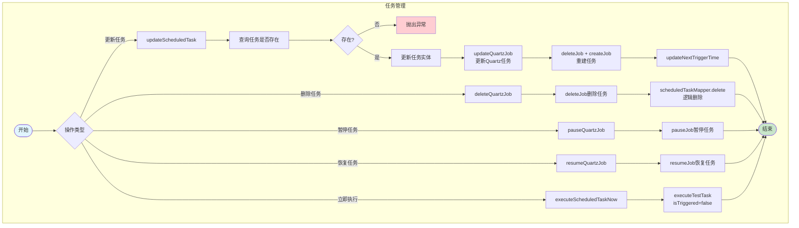
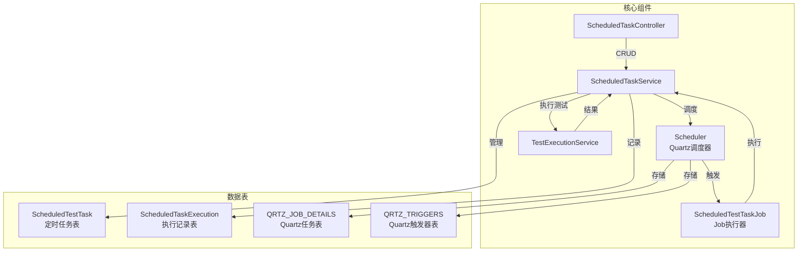
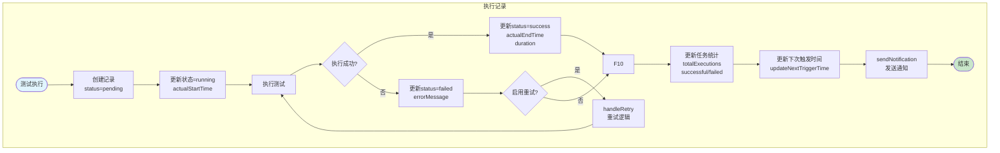

# Quartz调度流程图

## 1. 定时任务创建流程

## 2. Quartz触发执行流程

```mermaid
flowchart TD
    subgraph Quartz触发执行
        B1(["到达触发时间"]) --> B2[Quartz Scheduler<br/>调度器触发]
        B2 --> B3[ScheduledTestTaskJob.execute<br/>Job执行器]
        B3 --> B4[从JobDataMap获取<br/>taskId + userId]
        B4 --> B5[scheduledTaskService<br/>.executeScheduledTask]
        B5 --> B6[executeTestTask<br/>执行任务]
        
        B6 --> B7{检查任务状态}
        B7 -->|任务不存在/已删除| B8[抛出异常]
        B8 --> B20([结束])
        
        B7 -->|任务未启用| B9[检查isTriggered参数]
        B9 -->|非手动触发| B8
        B9 -->|手动触发| B10
        
        B7 -->|任务启用| B10[检查skipIfPreviousFailed<br/>上次失败是否跳过]
        B10 --> B11{上次执行状态}
        B11 -->|failed且skip=true| B12[跳过执行]
        B12 --> B20
        B11 -->|其他| B13[继续执行]
        
        B13 --> B14[创建执行记录<br/>ScheduledTaskExecution]
        B14 --> B15[scheduledTaskExecutionMapper.insert]
        B15 --> B16[更新状态=running<br/>设置actualStartTime]
        B16 --> B17[更新任务状态<br/>lastExecutionStatus=running<br/>totalExecutions++]
        B17 --> B18[executeTest<br/>执行测试]
        B18 --> B19[更新结果统计<br/>success/failed<br/>发送通知]
        B19 --> B20
    end

    style B1 fill:#e1f5fe
    style B20 fill:#c8e6c9
    style B8 fill:#ffcdd2
```

## 3. 测试执行详细流程

## 4. 任务管理流程（更新/删除/暂停）

## 5. 核心组件关系

## 6. 执行记录流程

## 流程说明

### 1. 任务创建
1. 用户通过Controller创建定时任务
2. Service构建`ScheduledTestTask`实体，保存到数据库
3. 根据触发器类型（cron/simple/daily/weekly/monthly）构建Quartz Trigger
4. 调用`scheduler.scheduleJob()`注册JobDetail和Trigger
5. 更新下次触发时间

### 2. Quartz触发执行
1. Quartz Scheduler在触发时间点触发任务
2. `ScheduledTestTaskJob.execute()`执行
3. 从JobDataMap获取taskId和userId
4. 调用`scheduledTaskService.executeScheduledTask()`
5. 创建执行记录`ScheduledTaskExecution`
6. 检查任务状态和跳过条件
7. 执行测试

### 3. 测试执行
- 支持多种执行模式：有caseIds列表、single_case、api、module、project、test_suite
- 调用`TestExecutionService`执行具体测试
- 提取执行结果统计
- 单独执行时生成测试报告
- 更新任务统计和执行记录

### 4. 任务管理
- **更新**：先删除旧任务，再创建新任务
- **删除**：删除Quartz任务 + 逻辑删除数据库记录
- **暂停/恢复**：暂停或恢复Quartz任务
- **立即执行**：直接调用executeTestTask执行

### 5. 执行记录
- 每次执行创建`ScheduledTaskExecution`记录
- 记录执行状态、时间、结果统计
- 支持重试机制
- 执行完成后发送通知