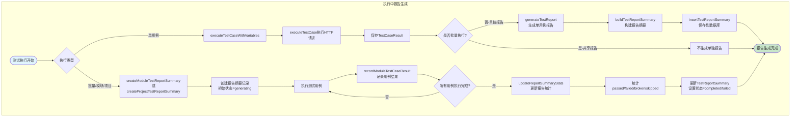
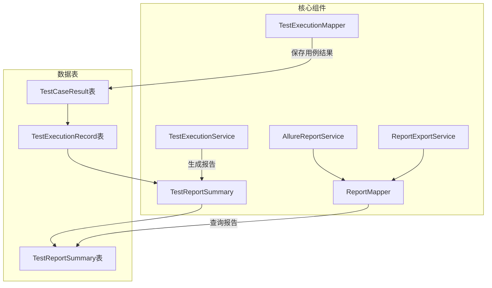
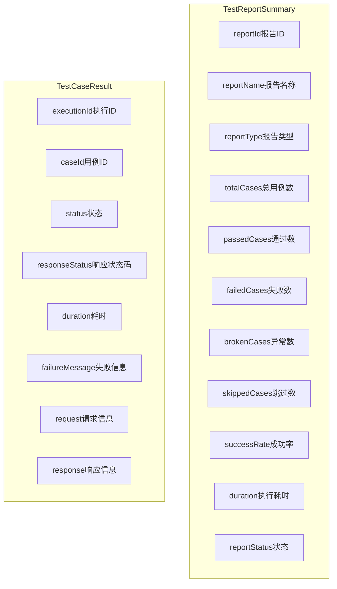

# 报告生成流程图

## 1. 测试执行中报告生成流程



## 2. Allure报告生成流程

```mermaid
flowchart TD
    subgraph Allure报告导出
        B1(["开始"]) --> B2[Controller接收请求<br/>exportAllureReport]
        B2 --> B3[AllureReportService.exportAllureReport]
        
        B3 --> B4[buildAllureReportData<br/>构建Allure报告数据]
        B4 --> B5[查询报告基础信息<br/>selectReportExportData]
        
        B5 --> B6[buildTestSuites<br/>构建测试套件列表]
        B6 --> B7[buildTestCaseDetails<br/>构建用例详情]
        
        B7 --> B8[buildTestSteps<br/>构建测试步骤]
        B8 --> B9[buildHttpRequest/Response<br/>构建HTTP请求响应]
        
        B9 --> B10[buildAssertions<br/>构建断言结果]
        B10 --> B11[buildAttachments<br/>构建附件信息]
        
        B11 --> B12[buildModuleStatistics<br/>构建模块统计]
        B12 --> B13[buildHistoryTrends<br/>构建历史趋势]
        
        B13 --> B14[AllureHTMLBuilder.build<br/>生成Allure格式HTML]
        B14 --> B15[返回ZIP压缩包<br/>Allure报告]
        B15 --> B16([结束])
    end

    style B1 fill:#e1f5fe
    style B16 fill:#c8e6c9
```



## 3. 企业报告生成流程（多格式导出）

```mermaid
flowchart TD
    subgraph 企业报告导出
        C1(["开始"]) --> C2[Controller接收请求<br/>/api/reports/{id}/export]
        C2 --> C3[ReportExportService.exportReport]
        
        C3 --> C4[validateExportQuery<br/>校验导出参数]
        C4 --> C5[validateReportForExport<br/>验证报告状态]
        
        C5 --> C6[getReportExportData<br/>获取导出数据]
        C6 --> C7[selectReportExportData<br/>查询报告基本信息]
        C7 --> C8[selectReportStatistics<br/>查询统计数据]
        
        C8 --> C9{是否包含详情?}
        C9 -->|是| C10[selectReportTestResults<br/>查询测试结果详情]
        C9 -->|否| C11
        
        C10 --> C11[构建ExportMetadata<br/>导出元数据]
        C11 --> C12[generateFileContent<br/>根据格式生成文件]
        
        C12 --> C13{导出格式}
        C13 -->|HTML| C14[HTMLTemplateBuilder.build<br/>生成HTML报告]
        C13 -->|PDF| C15[PDFBox生成PDF<br/>PDDocument]
        C13 -->|Excel| C16[生成Excel内容]
        C13 -->|CSV| C17[生成CSV内容]
        C13 -->|JSON| C18[ObjectMapper生成JSON]
        
        C14 --> C19[generateExportFileName<br/>生成文件名]
        C15 --> C19
        C16 --> C19
        C17 --> C19
        C18 --> C19
        
        C19 --> C20[返回ByteArrayResource]
        C20 --> C21([结束])
    end

    style C1 fill:#e1f5fe
    style C21 fill:#c8e6c9
```

## 4. 报告核心组件关系



## 5. 报告数据结构



## 流程说明

### 1. 测试执行中报告生成
- **单用例执行**：执行完成后调用 `generateTestReport()` 生成独立报告
- **批量/模块/项目执行**：先创建报告摘要记录（状态=generating），执行过程中记录每个用例结果，全部完成后更新统计信息

### 2. Allure报告导出
- 调用 `AllureReportService.exportAllureReport()`
- 构建 Allure 格式的数据结构（测试套件、用例、步骤、HTTP请求响应等）
- 使用 `AllureHTMLBuilder` 生成 Allure 风格的 HTML 报告
- 返回 ZIP 压缩包格式

### 3. 企业报告导出
- 支持多种格式：HTML、PDF、Excel、CSV、JSON
- **HTML**：使用 `HTMLTemplateBuilder` 生成，包含图表（Chart.js）
- **PDF**：使用 PDFBox 库生成，支持中文
- 查询报告基础信息、统计信息、测试结果详情
- 返回 `ByteArrayResource` 供下载