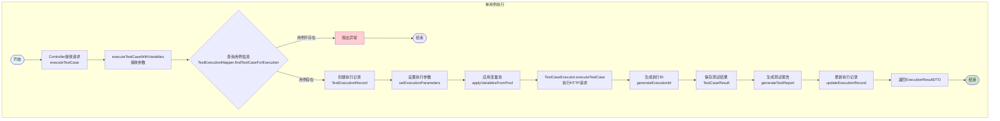
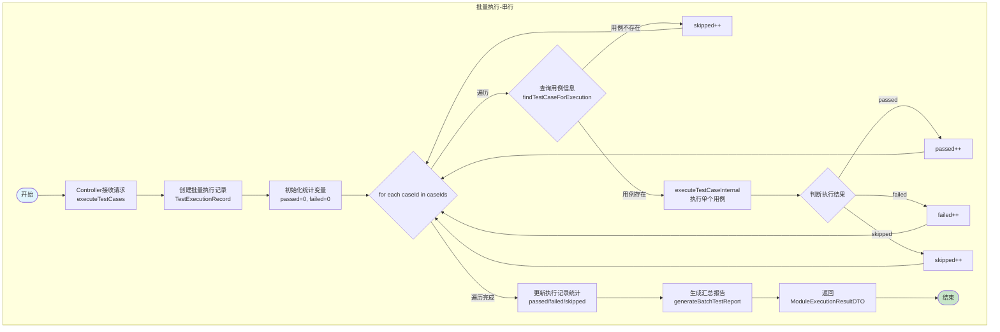
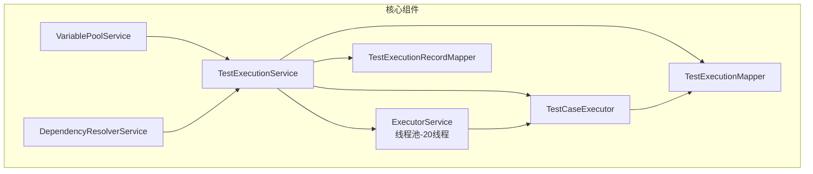

# 测试执行流程图

## 1. 单用例执行流程

## 2. 批量执行流程（串行）

## 3. 并发执行流程

```mermaid
flowchart TD
    subgraph 模块级并发执行
        C1(["开始"]) --> C2[executeTestCasesSync<br/>接收模块和用例列表]
        C2 --> C3[初始化变量池<br/>variablePoolService.initializePool]
        C3 --> C4[依赖排序<br/>dependencyResolverService.sortTestCasesByDependency]
        C4 --> C5[获取执行层级<br/>getExecutionLayers]
        C5 --> C6[创建执行记录<br/>TestExecutionRecord]
        C6 --> C7[创建测试报告<br/>createModuleTestReportSummary]
        C7 --> C8{for each layer in executionLayers}
        
        C8 -->|每层| C9[创建CompletableFuture列表]
        C9 --> C10{for each testCase in layer}
        
        C10 -->|每个用例| C11[CompletableFuture.runAsync<br/>提交到线程池executorService]
        C11 --> C12[executeTestCaseWithVariables<br/>执行用例]
        C12 --> C13{执行成功?}
        C13 -->|是| C14[收集结果 + 提取变量<br/>variablePoolService.setVariables]
        C14 --> C10
        C13 -->|否| C15[记录失败结果]
        C15 --> C10
        
        C10 --> C16[等待本层执行完成<br/>CompletableFuture.allOf.join]
        C16 --> C8
        
        C8 -->|所有层完成| C17[清理变量池<br/>variablePoolService.clearPool]
        C17 --> C18[计算统计结果<br/>passed/failed/skipped/broken]
        C18 --> C19[更新报告统计<br/>TestReportSummary]
        C19 --> C20[更新执行记录<br/>TestExecutionRecord]
        C20 --> C21[返回ModuleExecutionResultDTO]
        C21 --> C22([结束])
    end

    style C1 fill:#e1f5fe
    style C22 fill:#c8e6c9
```

## 4. 核心组件说明

## 流程说明

### 单用例执行
1. Controller 接收请求，调用 `executeTestCase()`
2. 查询用例信息，验证用例存在且启用
3. 创建执行记录 `TestExecutionRecord`
4. 调用 `TestCaseExecutor.executeTestCase()` 执行 HTTP 请求
5. 保存测试结果 `TestCaseResult`
6. 生成测试报告
7. 返回执行结果

### 批量执行（串行）
1. 接收用例 ID 列表
2. 创建批量执行记录
3. 遍历每个用例，串行调用 `executeTestCaseInternal()`
4. 统计通过/失败/跳过数量
5. 生成汇总报告
6. 返回结果

### 并发执行
1. 接收模块和用例列表
2. 通过依赖解析服务对用例排序，划分执行层级
3. 使用 `CompletableFuture.runAsync()` 提交到 20 线程的线程池
4. 按层级顺序执行（层内并发，层间串行）
5. 共享变量池存储提取的变量供依赖用例使用
6. 汇总统计结果，生成报告