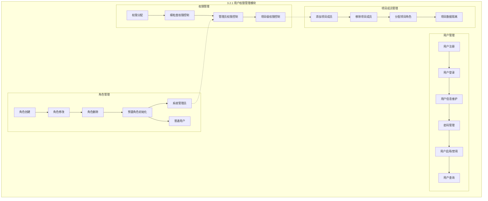
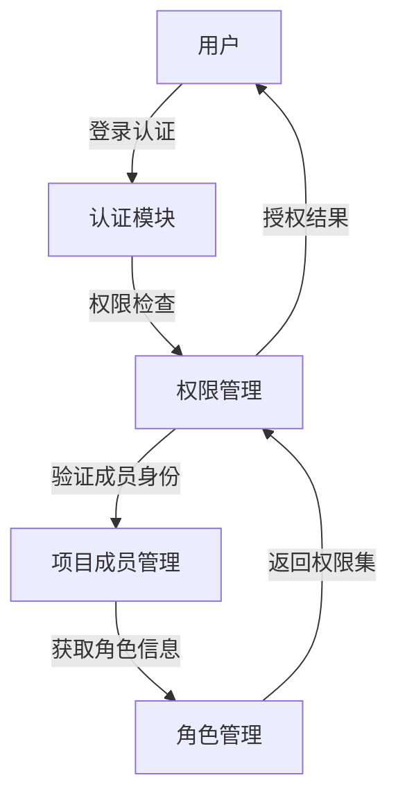

# 3.2.1 用户权限管理模块功能模块图

## 模块说明

| 模块 | 子功能 | 描述 |
|------|--------|------|
| **用户管理** | 用户注册、登录、信息维护、密码管理、启用/禁用、查询 | 支持用户的增删改查，密码加密存储，状态管理 |
| **角色管理** | 角色CRUD、预置角色 | 支持角色创建修改删除，预置系统管理员和普通用户 |
| **权限管理** | 权限分配、细粒度控制、项目级权限 | 基于项目成员的权限控制，管理员拥有所有权限 |
| **项目成员管理** | 添加/移除成员、分配角色、数据隔离 | 用户必须通过项目成员身份获得权限，实现项目间数据隔离 |

## 数据流向

