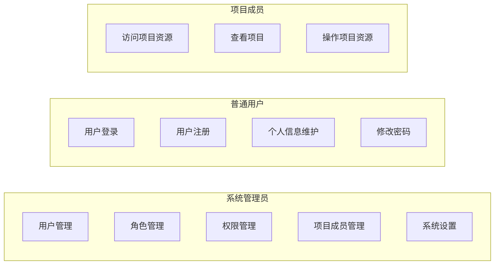
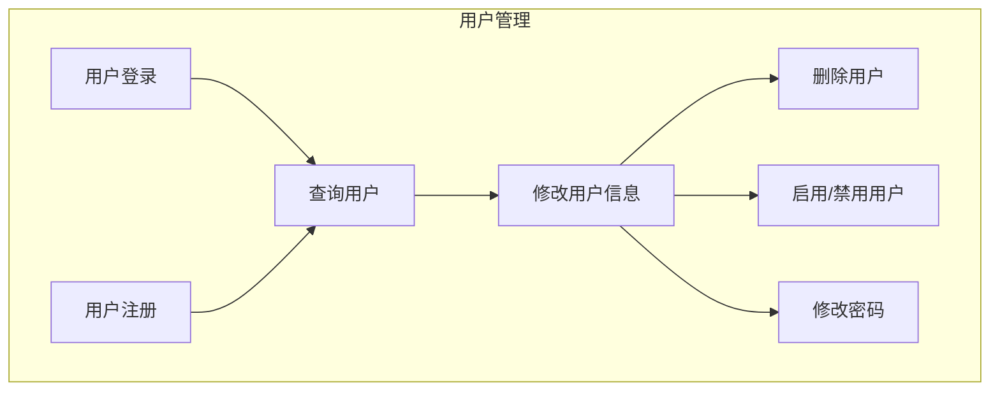
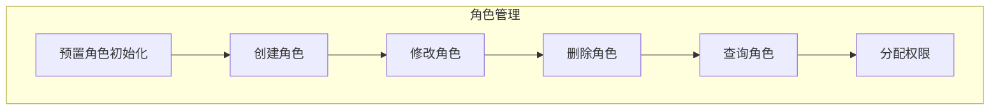
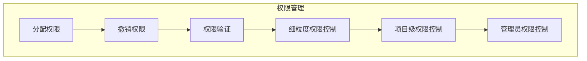
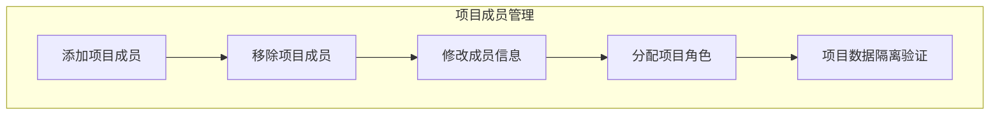

# 3.2.1 用户权限管理模块功能用例图

## 1. 总体功能用例图



## 2. 用户管理功能用例



## 3. 角色管理功能用例



## 4. 权限管理功能用例



## 5. 项目成员管理功能用例



## 6. 完整功能用例图

```mermaid
graph TD
    subgraph Actor
        Admin[系统管理员]
        User[普通用户]
        ProjectOwner[项目负责人]
        ProjectManager[项目管理员]
        Developer[开发人员]
        Tester[测试人员]
        Viewer[查看者]
    end

    subgraph 用户权限管理模块
        subgraph 用户管理
            U1[用户登录]
            U2[用户注册]
            U3[用户查询]
            U4[用户信息维护]
            U5[删除用户]
            U6[启用/禁用用户]
            U7[修改密码]
        end

        subgraph 角色管理
            R1[创建角色]
            R2[修改角色]
            R3[删除角色]
            R4[查询角色]
            R5[分配权限]
        end

        subgraph 权限管理
            P1[权限分配]
            P2[权限验证]
            P3[细粒度权限控制]
            P4[项目级权限控制]
        end

        subgraph 项目成员管理
            M1[添加项目成员]
            M2[移除项目成员]
            M3[修改成员信息]
            M4[分配项目角色]
            M5[项目数据隔离]
        end
    end

    Admin --> U1
    Admin --> U3
    Admin --> U4
    Admin --> U5
    Admin --> U6
    Admin --> U7

    Admin --> R1
    Admin --> R2
    Admin --> R3
    Admin --> R4
    Admin --> R5

    Admin --> P1
    Admin --> P2

    Admin --> M1
    Admin --> M2
    Admin --> M3
    Admin --> M4
    Admin --> M5

    User --> U1
    User --> U2
    User --> U7

    ProjectOwner --> M1
    ProjectOwner --> M2
    ProjectOwner --> M3
    ProjectOwner --> M4
    ProjectOwner --> M5
    ProjectOwner --> P2

    ProjectManager --> M1
    ProjectManager --> M2
    ProjectManager --> M3
    ProjectManager --> M4
    ProjectManager --> P2

    Developer --> P2
    Tester --> P2
    Viewer --> P2
```



## 7. 用例说明表

| 用例编号 | 用例名称 | 参与者 | 描述 |
|----------|----------|--------|------|
| UC-01 | 用户登录 | 普通用户、管理员 | 用户使用邮箱和密码登录系统 |
| UC-02 | 用户注册 | 普通用户 | 新用户注册账号 |
| UC-03 | 查询用户 | 管理员 | 分页查询用户列表，支持关键词搜索 |
| UC-04 | 修改用户信息 | 管理员 | 修改用户的基本信息 |
| UC-05 | 删除用户 | 管理员 | 软删除用户账户 |
| UC-06 | 启用/禁用用户 | 管理员 | 启用或禁用用户账号，被禁用用户无法登录 |
| UC-07 | 修改密码 | 普通用户、管理员 | 用户修改自己的登录密码 |
| UC-08 | 创建角色 | 管理员 | 创建新的角色 |
| UC-09 | 修改角色 | 管理员 | 修改角色的信息 |
| UC-10 | 删除角色 | 管理员 | 删除角色 |
| UC-11 | 分配权限 | 管理员 | 为角色分配权限 |
| UC-12 | 权限验证 | 系统 | 验证用户是否有操作权限 |
| UC-13 | 添加项目成员 | 项目负责人、管理员 | 将用户添加到项目中 |
| UC-14 | 移除项目成员 | 项目负责人、管理员 | 从项目中移除用户 |
| UC-15 | 分配项目角色 | 项目负责人、管理员 | 指定用户在项目中的角色 |
| UC-16 | 项目数据隔离 | 系统 | 确保用户只能访问授权的项目数据 |

## 8. 权限控制用例图

```mermaid
graph TD
    subgraph 权限控制流程
        Start[用户请求访问资源] --> Check1{用户是否为管理员?}
        Check1 -->|是| Allow[允许访问]
        Check1 -->|否> Check2{用户是否为项目成员?}
        Check2 -->|否| Deny[拒绝访问]
        Check2 -->|是> Check3{检查项目角色权限}
        Check3 --> Check4{角色是否有所需权限?}
        Check4 -->|是| Allow
        Check4 -->|否| Deny
    end
```
