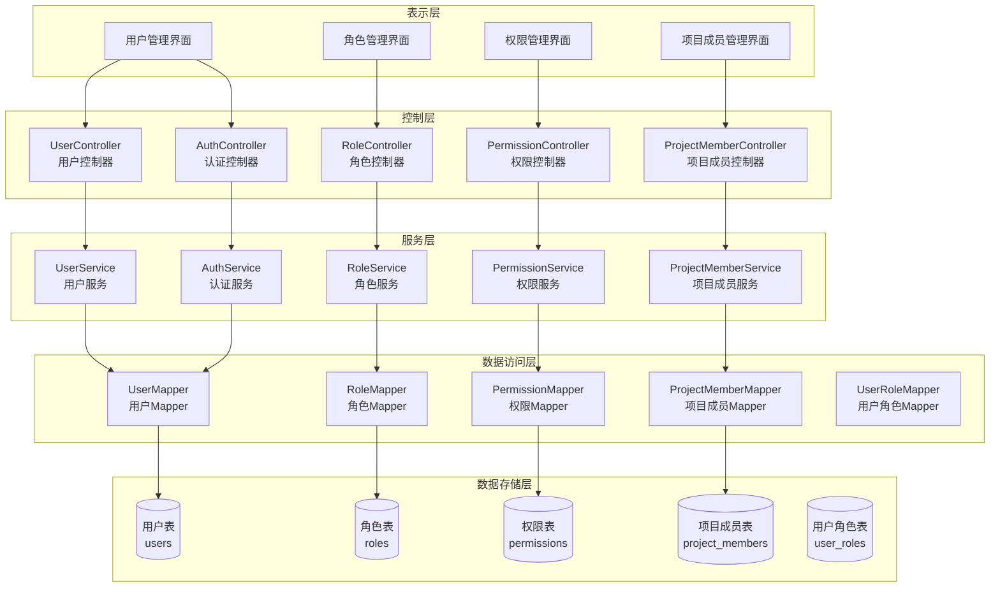
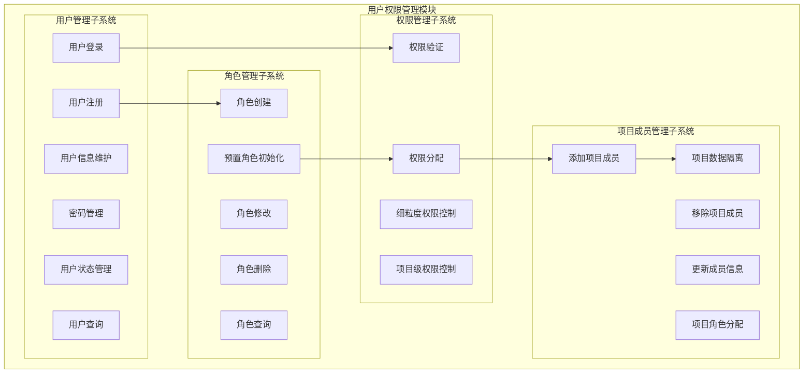
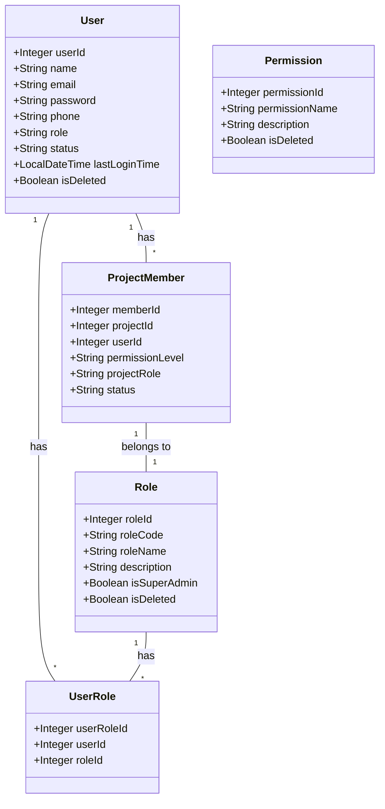
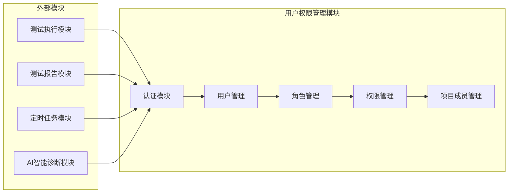

# 3.2.1 用户权限管理模块结构图

## 1. 模块结构图

```mermaid
graph TB
    subgraph 表示层
        UI1[用户管理界面]
        UI2[角色管理界面]
        UI3[权限管理界面]
        UI4[项目成员管理界面]
    end

    subgraph 控制层
        C1[AuthController<br/>认证控制器]
        C2[UserController<br/>用户控制器]
        C3[RoleController<br/>角色控制器]
        C4[PermissionController<br/>权限控制器]
        C5[ProjectMemberController<br/>项目成员控制器]
    end

    subgraph 服务层
        S1[UserService<br/>用户服务]
        S2[RoleService<br/>角色服务]
        S3[PermissionService<br/>权限服务]
        S4[ProjectMemberService<br/>项目成员服务]
        S5[AuthService<br/>认证服务]
    end

    subgraph 数据访问层
        D1[UserMapper<br/>用户Mapper]
        D2[RoleMapper<br/>角色Mapper]
        D3[PermissionMapper<br/>权限Mapper]
        D4[ProjectMemberMapper<br/>项目成员Mapper]
        D5[UserRoleMapper<br/>用户角色Mapper]
    end

    subgraph 数据存储层
        DB1[(用户表<br/>users)]
        DB2[(角色表<br/>roles)]
        DB3[(权限表<br/>permissions)]
        DB4[(项目成员表<br/>project_members)]
        DB5[(用户角色表<br/>user_roles)]
    end

    UI1 --> C1
    UI1 --> C2
    UI2 --> C3
    UI3 --> C4
    UI4 --> C5

    C1 --> S5
    C2 --> S1
    C3 --> S2
    C4 --> S3
    C5 --> S4

    S1 --> D1
    S2 --> D2
    S3 --> D3
    S4 --> D4
    S5 --> D1

    D1 --> DB1
    D2 --> DB2
    D3 --> DB3
    D4 --> DB4
```

## 2. 模块内部结构

```mermaid
graph TD
    subgraph 用户权限管理模块
        subgraph 用户管理子系统
            UM1[用户注册]
            UM2[用户登录]
            UM3[用户信息维护]
            UM4[密码管理]
            UM5[用户状态管理]
            UM6[用户查询]
        end

        subgraph 角色管理子系统
            RM1[角色创建]
            RM2[角色修改]
            RM3[角色删除]
            RM4[角色查询]
            RM5[预置角色初始化]
        end

        subgraph 权限管理子系统
            PM1[权限分配]
            PM2[权限验证]
            PM3[细粒度权限控制]
            PM4[项目级权限控制]
        end

        subgraph 项目成员管理子系统
            PMM1[添加项目成员]
            PMM2[移除项目成员]
            PMM3[更新成员信息]
            PMM4[项目角色分配]
            PMM5[项目数据隔离]
        end
    end

    UM1 --> RM1
    UM2 --> PM2
    RM5 --> PM1
    PM1 --> PMM1
    PMM1 --> PMM5
```

## 3. 核心类图

```mermaid
classDiagram
    class User {
        +Integer userId
        +String name
        +String email
        +String password
        +String phone
        +String role
        +String status
        +LocalDateTime lastLoginTime
        +Boolean isDeleted
    }

    class Role {
        +Integer roleId
        +String roleCode
        +String roleName
        +String description
        +Boolean isSuperAdmin
        +Boolean isDeleted
    }

    class Permission {
        +Integer permissionId
        +String permissionName
        +String description
        +Boolean isDeleted
    }

    class ProjectMember {
        +Integer memberId
        +Integer projectId
        +Integer userId
        +String permissionLevel
        +String projectRole
        +String status
    }

    class UserRole {
        +Integer userRoleId
        +Integer userId
        +Integer roleId
    }

    User "1" -- "*" UserRole : has
    Role "1" -- "*" UserRole : has
    User "1" -- "*" ProjectMember : has
    ProjectMember "1" -- "1" Role : belongs to
```

## 4. 模块依赖关系

```mermaid
graph LR
    subgraph 外部模块
        EX1[测试执行模块]
        EX2[测试报告模块]
        EX3[定时任务模块]
        EX4[AI智能诊断模块]
    end

    subgraph 用户权限管理模块
        A[认证模块]
        B[用户管理]
        C[角色管理]
        D[权限管理]
        E[项目成员管理]
    end

    EX1 --> A
    EX2 --> A
    EX3 --> A
    EX4 --> A

    A --> B
    B --> C
    C --> D
    D --> E
```
