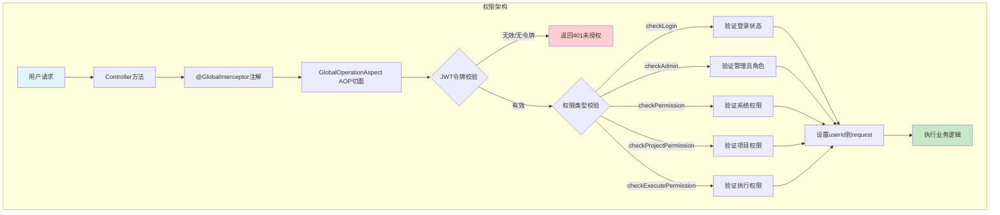
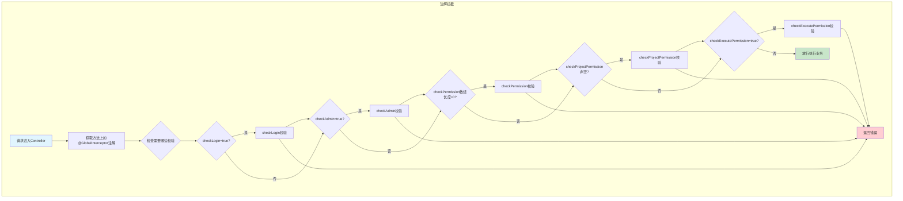
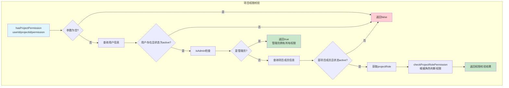
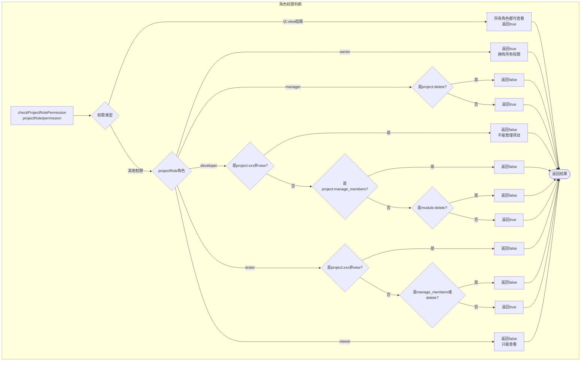
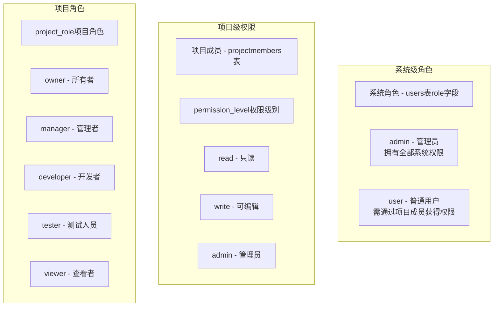
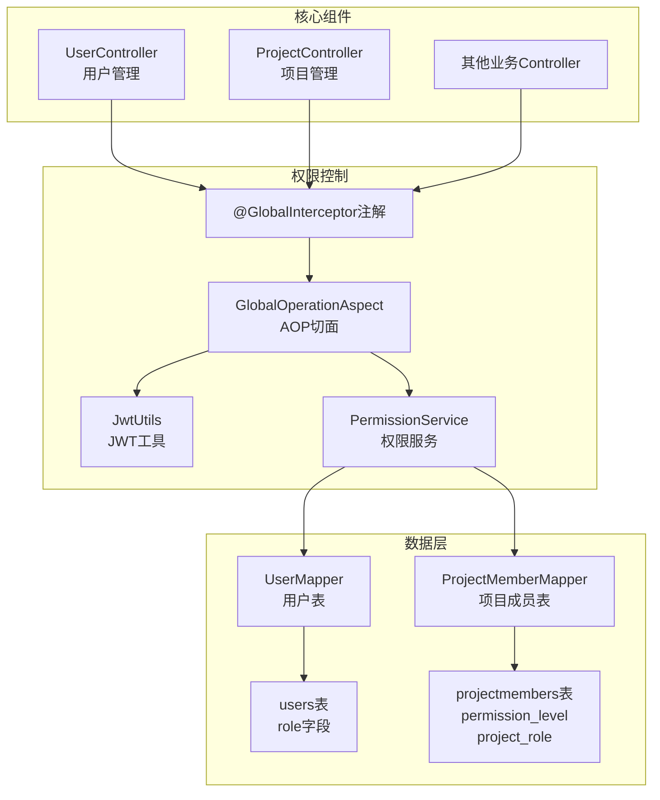

# 用户权限管理模块设计流程图

## 1. 整体权限架构

## 2. JWT认证流程

```mermaid
flowchart TD
    subgraph 用户登录
        B1(["用户登录"]) --> B2[AuthController.login]
        B2 --> B3[UserService验证用户名密码]
        B3 --> B4{验证成功?}
        
        B4 -->|否| B5[返回错误]
        B4 -->|是| B6[jwtUtils.generateToken<br/>生成JWT令牌]
        
        B6 --> B7[返回token给客户端]
        B7 --> B8([登录成功])
    end
    
    subgraph 请求验证
        B9(["后续请求"]) --> B10[获取Header中的Authorization]
        B10 --> B11{是否有Bearer Token?}
        
        B11 -->|否| B12[返回901未登录错误]
        B11 -->|是| B13[提取Token字符串]
        
        B13 --> B14[jwtUtils.validateToken<br/>验证Token有效性]
        B14 --> B15{Token有效?}
        
        B15 -->|否| B16[返回901未登录错误]
        B15 --> B17[jwtUtils.getUserIdFromToken<br/>获取用户ID]
        
        B17 --> B18[设置userId到request属性]
        B18 --> B19[执行业务逻辑]
    end

    style B1 fill:#e1f5fe
    style B8 fill:#c8e6c9
    style B12 fill:#ffcdd2
    style B16 fill:#ffcdd2
```

## 3. GlobalInterceptor注解校验流程

## 4. 项目权限校验流程（hasProjectPermission）

## 5. 项目角色权限矩阵

## 6. 权限级别说明

## 7. 核心组件关系

## 流程说明

### 1. 整体权限架构
1. 用户请求进入Controller方法
2. 方法上的`@GlobalInterceptor`注解触发AOP切面
3. 切面进行JWT令牌校验
4. 根据注解参数进行相应权限校验（登录/管理员/系统权限/项目权限/执行权限）
5. 校验通过后设置userId到request属性，执行业务逻辑

### 2. JWT认证流程
- **登录**：验证用户名密码成功后，调用`jwtUtils.generateToken()`生成JWT令牌返回给客户端
- **后续请求**：从Header中获取Authorization Bearer Token，调用`jwtUtils.validateToken()`验证有效性，有效则获取userId设置到request

### 3. GlobalInterceptor注解校验流程
- **checkLogin**：验证用户是否登录
- **checkAdmin**：验证是否是管理员
- **checkPermission**：验证系统权限
- **checkProjectPermission**：验证项目权限
- **checkExecutePermission**：验证执行权限

### 4. 项目权限校验流程
1. 接收userId/projectId/permission参数
2. 检查用户是否存在且状态为active
3. 管理员直接拥有所有权限
4. 查询项目成员信息
5. 根据projectRole调用`checkProjectRolePermission()`判断权限

### 5. 项目角色权限矩阵
- **owner**：拥有所有权限
- **manager**：除删除项目外所有权限
- **developer**：不能管理项目和成员，不能删除模块
- **tester**：不能删除项目/模块/接口/用例/任务
- **viewer**：只能查看