# 登录认证流程图

```mermaid
flowchart TD
    subgraph 登录流程
        A1(["开始"]) --> A2[前端发送POST请求<br/>/api/auth/login<br/>email + password]
        A2 --> A3[AuthController.login<br/>接收请求]
        A3 --> A4[UserService.login<br/>调用业务层]
        A4 --> A5{查询用户<br/>UserMapper.selectUserByEmail}
        
        A5 -->|用户不存在| A6[抛出异常<br/>邮箱或密码错误]
        A6 --> A20[返回登录失败]
        
        A5 -->|用户存在| A7{验证密码<br/>PasswordUtils.matches}
        A7 -->|密码错误| A8[抛出异常<br/>邮箱或密码错误]
        A8 --> A20
        
        A7 -->|密码正确| A9{检查用户状态<br/>status == 'active'}
        A9 -->|状态禁用| A10[抛出异常<br/>账户已被禁用]
        A10 --> A20
        
        A9 -->|状态正常| A11[更新最后登录时间<br/>UserMapper.updateLastLoginTime]
        A11 --> A12[生成JWT Token<br/>JwtUtils.generateToken]
        A12 --> A13[返回LoginResponseDTO<br/>token + userInfo]
        A13 --> A14([登录成功])
    end

    subgraph 后续请求认证流程
        B1(["开始"]) --> B2[前端发送请求<br/>Header: Authorization: Bearer token]
        B2 --> B3[GlobalInterceptor/AOP切面<br/>拦截请求]
        B3 --> B4{从Header提取Token<br/>Bearer xxx}
        
        B4 -->|无Token或格式错误| B5[返回401 Unauthorized]
        
        B4 -->|有Token| B6{JwtUtils.validateToken<br/>验证Token有效性}
        B6 -->|Token无效或过期| B7[返回401 Unauthorized]
        
        B6 -->|Token有效| B8[从Token解析userId<br/>JwtUtils.getUserIdFromToken]
        B8 --> B9[设置userId到request属性<br/>request.setAttribute]
        
        B9 --> B10{需要权限校验?}
        
        B10 -->|是| B11[PermissionService<br/>checkPermission]
        B11 --> B12{权限校验通过?}
        B12 -->|否| B13[返回403 Forbidden]
        B12 -->|是| B14[放行到Controller]
        
        B10 -->|否| B14
        
        B14 --> B15([请求处理完成])
    end

    style A1 fill:#e1f5fe
    style A14 fill:#c8e6c9
    style B1 fill:#e1f5fe
    style B15 fill:#c8e6c9
    style B5 fill:#ffcdd2
    style B7 fill:#ffcdd2
    style B13 fill:#ffcdd2
```

## 流程说明

### 登录流程
1. 前端 POST `/api/auth/login`，携带 email 和 password
2. AuthController 接收请求，调用 UserService.login()
3. 根据 email 查询用户记录
4. 使用 PasswordUtils 验证密码
5. 检查用户状态是否为 active
6. 更新最后登录时间
7. 生成 JWT Token
8. 返回登录成功响应

### 后续请求认证流程
1. 前端请求携带 Authorization: Bearer token
2. GlobalInterceptor AOP 切面拦截请求
3. 从 Header 提取 Token 并验证
4. Token 有效则解析出 userId
5. 如需权限校验，调用 PermissionService
6. 校验通过则放行到 Controller